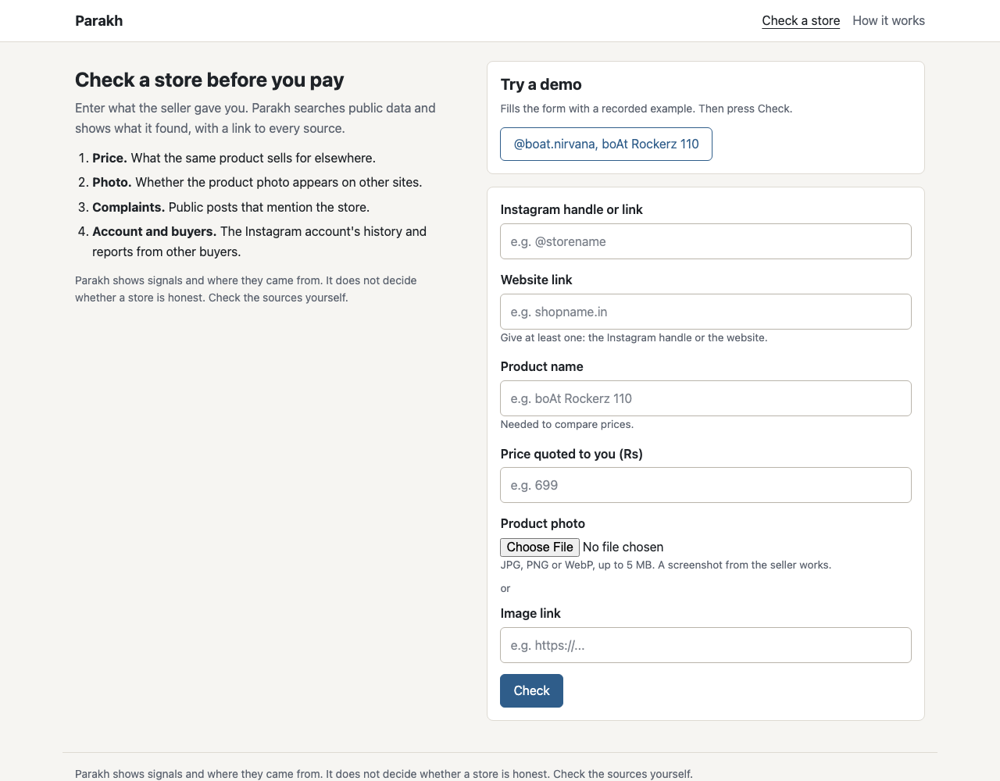
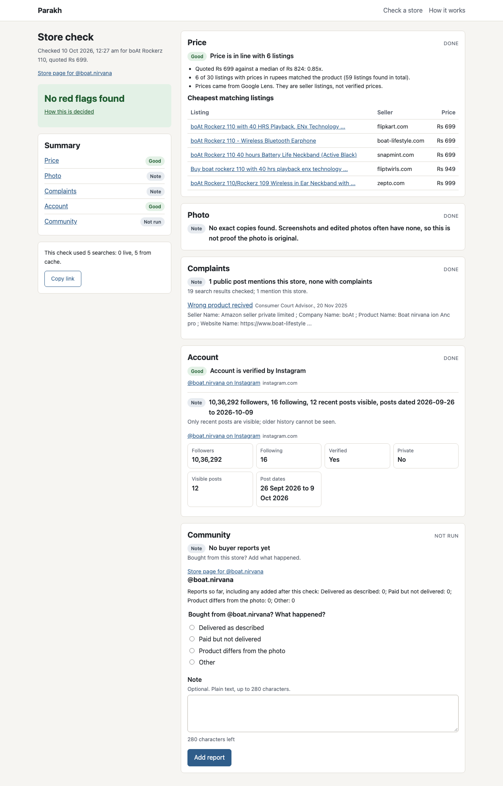

# Parakh

Parakh helps a buyer in India check an Instagram or website store before paying
by UPI. You enter the store handle or link, the product name, the price you were
quoted and a product photo. Parakh searches public data through SerpApi and
returns a report: what the same product costs elsewhere, whether the photo is
copied from other sites, what people say about the store, and how old and active
the account is. Every finding links to its source.

It is for buyers who are about to pay a small seller they cannot otherwise
check. Built for the SerpApi India Hackathon 2026 (Commerce and Market
Intelligence track).

| Check page | Report page |
|---|---|
|  |  |

## Quick start (replay mode, no API key)

Needs [uv](https://docs.astral.sh/uv/) (it installs Python 3.12 if missing) and
Node.js 20 or newer.

```bash
git clone <repo-url> parakh && cd parakh
cd frontend && npm install && npm run build && cd ..
cd backend && uv run uvicorn app.main:app
```

Open http://127.0.0.1:8000, press the **@boat.nirvana, boAt Rockerz 110** demo
button, then **Check**. Replay mode answers every search from the recorded
responses in `backend/tests/fixtures/serp/`, so no key and no credits are needed.

To watch the report fill in one signal at a time in replay, start the backend
with `REPLAY_DELAY_MS=1200 uv run uvicorn app.main:app`.

### Development (two processes)

```bash
cd backend && uv run uvicorn app.main:app --reload     # API on :8000
cd frontend && npm run dev                             # UI on :5173, proxies /api
```

### Live mode

```bash
cp .env.example .env
```

Then edit `.env`: set `SERPAPI_MODE=live` and `SERPAPI_KEY=<your key>`. The key
is read from the environment only; it never appears in responses, logs or
fixtures. `SERPAPI_MODE=record` works like live and also saves each response as
a fixture (key removed). To record a new demo store:

```bash
cd backend
uv run python -m app.tools.record --instagram @handle --image path/to/photo.jpg --product "Product name"
```

Without uv: `cd backend && python -m venv .venv && . .venv/bin/activate &&
pip install -e . && uvicorn app.main:app`.

## How it uses SerpApi

| Engine | Used for | Why it matters |
|---|---|---|
| `google_lens`, type=all | Listings of the same product with INR prices (country=in) | Shows whether the quoted price is a large markup |
| `google_lens`, type=exact_matches | Other sites that show the exact product photo | Photos copied from marketplaces suggest resold or dropshipped goods |
| `google_shopping` | Price listings for the product name | Fallback when Lens gives fewer than 3 matching priced listings |
| `google` | The store handle or domain with complaint words | Public complaints about non-delivery or fake goods |
| `google_forums` | The store handle or domain on forums | Buyer discussions that general search misses |
| `instagram_profile` | Followers, verified and private flags, bio link, recent posts | Very new or private accounts, bio links to a different site |
| Image upload (`serpapi.com/image`) | Sends the buyer's photo to Lens | Lets Lens search a screenshot the buyer has, not only a public URL |

Measured during development:

- The image upload does not cost a search (the account showed 250 searches left
  before and after an upload).
- Lens sometimes returns only an AI overview, with no visual matches, for an
  image that returned 60 matches on another call. That is why Google Shopping is
  the price fallback.
- A check spends at most 6 searches: Lens all, Lens exact, Instagram, Google,
  Forums, and Shopping only when needed.
- Responses are cached for 24 hours (`CACHE_TTL_HOURS`), so a repeat check
  spends nothing. A daily cap (`DAILY_SEARCH_CAP`, default 40) stops live
  searches; cached and replay checks keep working.

## How the verdict works

Each signal produces findings marked good, note, caution or red flag. Points are
added up and mapped to one of four results: "High risk", "Be careful", "No red
flags found" or "Not enough data". The exact thresholds are on the app's
**How it works** page (`/about`, built from `GET /api/meta/rules`) and in
[docs/02-design.md](docs/02-design.md) section 6.

Parakh shows signals and where they came from. It does not decide whether a store
is honest, and it never labels a store.

## Architecture

```
Vue 3 SPA  --HTTP JSON-->  FastAPI  --> CheckRunner (background task)
                              |              |
                              |              +--> signals/*  (pure functions over normalized data)
                              |              +--> serp/client (cache -> ledger -> SerpApi)
                              v
                           SQLite (SQLAlchemy 2.0)
```

```
backend/
  app/
    main.py          app, error format, serves frontend/dist when built
    config.py        settings from env
    models.py db.py  tables and session
    serp/            SerpApi client (cache, ledger, cap, modes), engines, image upload
    signals/         price, photo, complaints, account, community, verdict, rules
    checks/runner.py runs one check, writes evidence as each signal finishes
    api/             checks, stores, reports, meta, demos
    tools/           record.py (fixtures), credits.py (searches left)
  demo/              demo inputs and photo
  tests/             pytest suite and recorded fixtures
frontend/            Vite + Vue 3 + vue-router, plain CSS
docs/                requirements, design, test plan and report, backlog
```

## Testing

```bash
cd backend && uv run pytest -q
```

92 tests, no network: unit tests for every signal rule, the SerpApi client
against mocked HTTP, the check runner on the recorded demo fixtures, and the API.
See [docs/03-test-plan.md](docs/03-test-plan.md) and the results in
[docs/04-test-report.md](docs/04-test-report.md).

## Docs

- [docs/00-project-plan.md](docs/00-project-plan.md): process, milestones, risks
- [docs/01-requirements.md](docs/01-requirements.md): requirements (FR, NFR)
- [docs/02-design.md](docs/02-design.md): design and change log
- [docs/03-test-plan.md](docs/03-test-plan.md): test cases
- [docs/04-test-report.md](docs/04-test-report.md): test results
- [docs/05-backlog.md](docs/05-backlog.md): deferred items

## Limits

- Only recent Instagram posts are visible, so older account history cannot be
  checked.
- Lens results vary between calls for the same image; prices are seller
  listings, not verified prices.
- Complaint search finds only public posts that name the store.
- The app shows signals and their sources, not a judgement about the seller.
- Rate limits are in memory for one process: 10 checks and 5 reports per hour
  per IP.

## AI tools used

Built with Claude (design review) and Claude Code (implementation).
